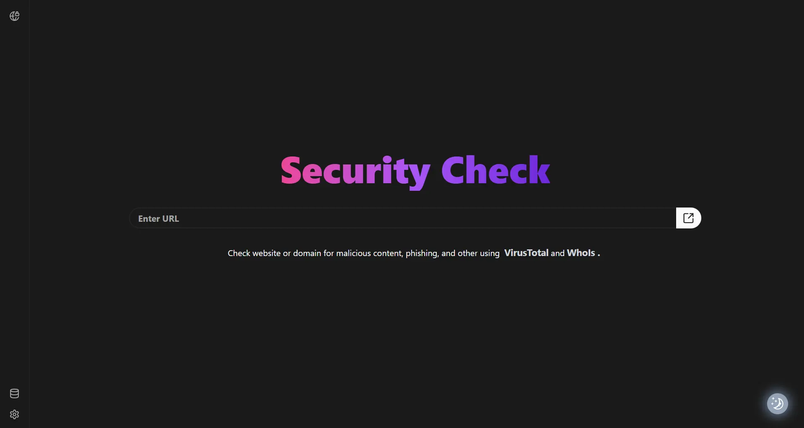

# Security Plus

<div style="padding:8px 0;">
  
</div>

## Introduction

Security Plus is a Chrome extension that helps you control and monitor website access, protecting you from potentially harmful websites. It provides a simple interface to manage website permissions and check site safety through VirusTotal and whoIs.

## Features

1. **Website Access Control**

   - Intercepts all website visits with a decision page
   - Manage permissions for individual websites or entire domains
   - View detailed website information before accessing using virusTotal and whoIs

2. **Security Features**

   - Domain-level blocking and allowing
   - Page-level blocking and allowing
   - Persistent settings storage

3. **User Interface**
   - Clean and intuitive decision page
   - Quick access through browser extension icon
   - Easy-to-use settings management
   - You can use shortcuts to
     for web access control.

## Installation

1. Clone the repository:

   ```bash
   git clone https://github.com/AhmedHanye/Security-Plus.git
   ```

2. Install dependencies and build:

   ```bash
   cd Security-Plus/Extension
   npm install
   npm run build
   ```

3. Load in Chrome:
   - Open Chrome and navigate to `chrome://extensions/`
   - Enable "Developer mode" in the top right
   - Click "Load unpacked"
   - Select the `Extension/dist` folder

## Usage

1. **First Visit**

   - When visiting a new website, you'll see the decision page
   - Choose to allow or block the site/domain

2. **Managing Permissions**

   - Click the extension icon to access settings
   - View and modify existing rules

3. **Helper Tools**
   - VirusTotal and whoIs iframes

## Technologies

- React
- TypeScript
- Tailwind CSS
- chrome-extension v3
- [react-mosaic](https://github.com/nomcopter/react-mosaic)
- shadcn

## License

This project is licensed under the MIT License - see the [LICENSE](./LICENSE) file for details.

## Acknowledgements

- [VirusTotal](https://www.virustotal.com/gui/home/upload)
- [whoIs](https://who.is/)

## Contributors

- [Ahmed Hany](https://www.linkedin.com/in/ahmed-hanye)
